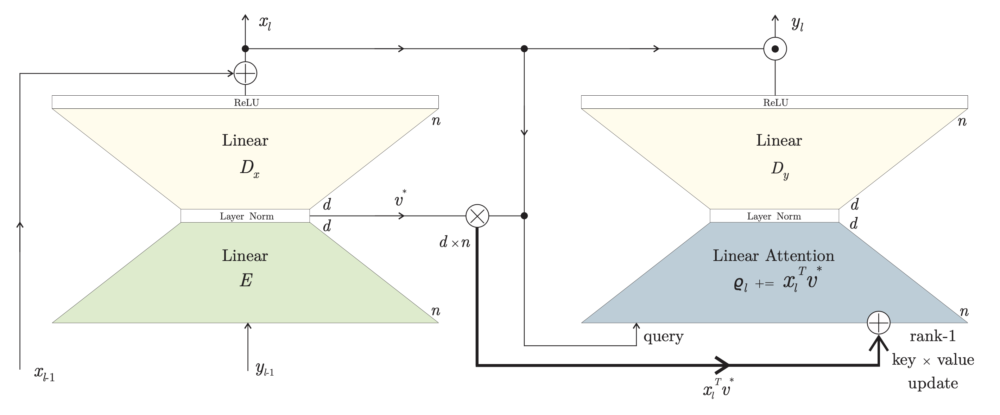
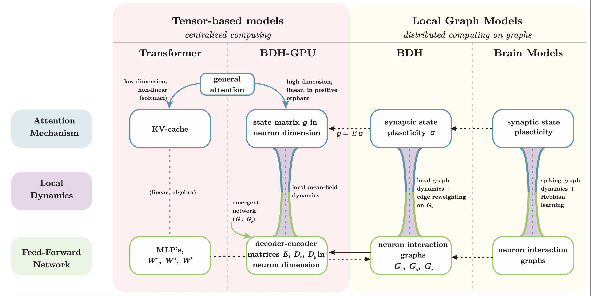
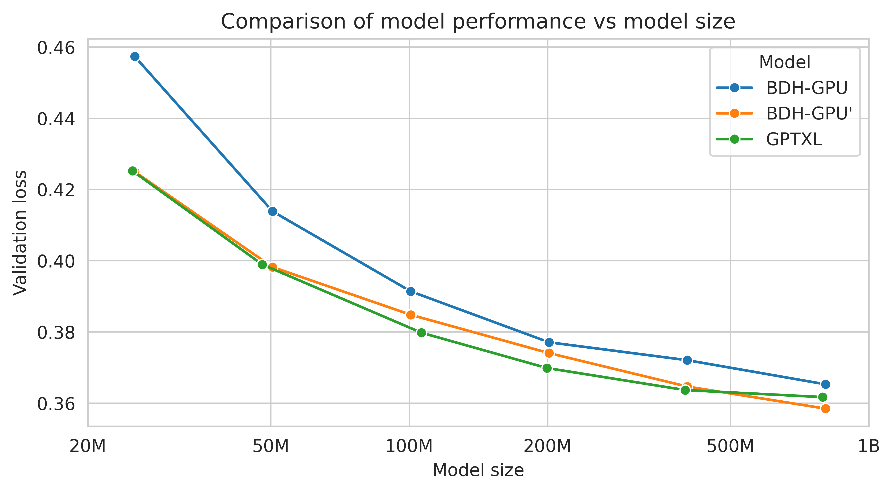

# Multi-Channel Hebbian Plasticity in Multilayer BDH

**Solves context-conditional binding by partitioning memory.** A learned gate finds the partition, reliably with restarts for two streams; four streams are the open problem.

This repository is a research fork of Pathway's [BDH (Dragon Hatchling)](https://github.com/pathwaycom/bdh). It extends BDH's Hebbian working memory with several memory channels and a gate that spreads each token's write over the channels and blends its read from them. The research sections below follow Revision 6 (preliminary) of the project's technical report. A short section at the end lists what has changed since that revision. The original BDH README from Pathway follows the research part, [unchanged](#about-bdh-upstream-readme-from-pathway).

---

## Contents

- [Summary](#summary)
- [Status, machines and the Phase IV tests](#status-machines-and-the-phase-iv-tests)
- [1. Background](#1-background)
- [2. Phases I–III in brief](#2-phasesiiii-in-brief)
- [3. The binding task and how runs are scored](#3-the-binding-task-and-how-runs-are-scored)
- [4. The readout harms the gate through its gradient](#4-the-readout-harms-the-gate-through-its-gradient)
- [5. At two streams, more channels do not help; restarts do](#5-at-two-streams-more-channels-do-not-help-restarts-do)
- [6. The layout is not the lever; failures are early position splits](#6-the-layout-is-not-the-lever-failures-are-early-position-splits)
- [7. A short convolution opens a second route to binding](#7-a-short-convolution-opens-a-second-route-to-binding)
- [8. Eight and sixteen keys per stream](#8-eight-and-sixteen-keys-per-stream)
- [9. Four streams](#9-four-streams)
- [10. Exploratory screens](#10-exploratory-screens)
- [11. Where the mechanism stands](#11-where-the-mechanism-stands)
- [12. Retrospective](#12-retrospective)
- [13. Methodological findings](#13-methodological-findings)
- [14. Limitations](#14-limitations)
- [15. Distance to a language model](#15-distance-to-a-language-model)
- [16. Conclusion and next steps](#16-conclusion-and-next-steps)
- [Updates since Revision 6](#updates-since-revision-6)
- [Repository layout and how to run the tests](#repository-layout-and-how-to-run-the-tests)
- [Provenance](#provenance)
- [References](#references)
- [About BDH (upstream README from Pathway)](#about-bdh-upstream-readme-from-pathway)

---

## Summary

Revision 5 established two things on a context-conditional binding task:
- two Hebbian memory channels with a hand-set routing bind two conflicting streams, where no single channel does;
- a gate trained from the task loss alone finds that routing on about half of its runs.

Revision 6 adds Phase IV: ten pre-registered tests, each run on two machines, and a first batch of exploratory screens. The second machine has also replicated Revision 5's confirmatory result.

**The readout.** Revision 5 blamed the readout path from scratch runs. A pre-registered test now confirms that it harms the gate through its gradient (both machines, p < 10⁻⁷).

**Two streams.** More channels do not raise the learned gate's rate. A restart rule that reads only held-out accuracy at step 2400 ended with the routing in 60 of 60 trials.

**A short convolution** (standard in modern linear-attention models) does not replace the gate at the working learning rate: one channel bound 7/80, the gate with the convolution 51/80. It does open a second route to binding. At a four-times higher learning rate, one channel with the convolution binds 34/80, carrying the context token to the value position through its lag-2 weight, as predicted.

**Eight keys per stream.** An apparent collapse of the learned gate turned out to be the learning rate.
- At 10⁻³ the gate binds from scratch in 49 of 70 runs, and with a load curriculum and restarts in 40 of 40.
- A single channel with the same fast-weight memory and 1.8 times the parameters bound 0 of 24. **The advantage is the partition, not the memory.**
- A three-stage curriculum reached sixteen keys on 8 of 10 runs (descriptive).

**Four streams.** With four channels the gate binds 14/40, and most failures merge two or three streams into one channel.
- Eight or sixteen channels nearly remove the merges (16 → 4 → 1) and bind 23/40 each. The pre-registered claims split between machines and pool to a modest gain. *A later test found more merges at sixteen channels, so "nearly remove" overstates it; see [Updates since Revision 6](#updates-since-revision-6).*
- What remains is the original failure: an early commitment to a split by something other than the stream.

**The outcome is decided early.** Across Phase IV a run's outcome is settled in its first few thousand steps. Exploratory screens suggest it depends on what the memory learns first. Post hoc, a simple early check at four streams picked binders with 38/38 precision; that check has since been tested on fresh seeds (see the updates).

**Corrections.** Revision 6 also corrects six of our own errors from Phase IV, including a learning-rate slip in scratch runs and a misreading of the curriculum result.

## Status, machines and the Phase IV tests

Phases I–III are condensed in [Section 2](#2-phasesiiii-in-brief); Revision 5 has their full account.

Machines:
- **X:** Intel Xeon at 2.10 GHz, a cloud container. It ran every Phase IV test.
- **L:** Intel i7-12650H. It also ran every Phase IV test.
- **E:** Intel Xeon at 2.80 GHz. It runs exploratory screens on a separate branch, and reproduces X's runs bit for bit at one thread ([Section 10](#10-exploratory-screens)).

Training is deterministic on a given machine and thread count, but seed-level outcomes differ between machines. So every verdict is per machine. Where the two machines split we say so, and pool post hoc with paired tests, labelled as such.

Revision 6 is preliminary in three respects:
- when it was written, the four-stream recipe test and the second exploratory batch were still running (both have since finished; see the updates);
- the screens are screens, not results;
- everything is one small model on a synthetic task.

[Section 12](#12-retrospective) gives the status of Revision 5's claims and the errors made in Phase IV.

**Table 1. Phase IV.** Each test is a file `test_<name>.py` whose docstring records its pre-registered design and, after the run, its result. Every verdict was fixed before the test ran and printed mechanically. Interpretation beyond the verdict is labelled as diagnostic or post hoc wherever it appears. The [Provenance](#provenance) section lists the commits.

| test | question | verdict on X | verdict on L | § |
|---|---|---|---|---|
| `readout_path` | is the readout's harm its gradient or its timing? | R1 CONFIRMED, R2 GRADIENT, R3 TIMING HELPS | same | 4 |
| `router_reliability` | do more channels, or restarts, make routing reliable? | K4, K8 NOT SHOWN; RESTART RELIABLE | same | 5 |
| `router_layout` | does the order of the bindings change discovery? | L1, L2 NOT SHOWN | same | 6 |
| `short_conv` | can one channel bind with a short convolution? | K1 NOT SHOWN; K2 DIFFERENT (gate higher); K3 SHOWN | same | 7 |
| `conv_lr` | does a learning rate of 4×10⁻³ change that? | LR1 SHOWN; LR2, LR3, LR4 NOT SHOWN; M1 SHOWN | LR1, LR3 SHOWN; LR2, LR4 NOT SHOWN; M1 SHOWN | 7 |
| `p_scaling` | does the gate's advantage grow from 4 to 8 keys? | P1, P2, P3 NOT SHOWN; M1-P8 SHOWN | P1 SHOWN; P2, P3 NOT SHOWN; M1-P8 SHOWN | 8.1 |
| `load_curriculum` | does routing found at 4 keys survive the switch to 8? | C1, C2, C3 SHOWN; C4 RELIABLE | C1 NOT SHOWN (p = 0.058); C2, C3 SHOWN; C4 MAJORITY | 8.2 |
| `curriculum_confirm` | at a constant rate, curriculum or from scratch? | K1 NOT SHOWN; K2 SHOWN; K3 RELIABLE | same | 8.3 |
| `scale_axes` | one channel with the same memory at 8 keys; four streams | M1 SHOWN; S1 MINORITY; S2 SHOWN | M1 SHOWN; S1 MINORITY; S2 NOT SHOWN | 8.4, 9 |
| `stream_channels` | do spare channels reduce four-stream merges? | K8, K16, MG NOT SHOWN | K8, K16, MG SHOWN | 9.2 |
| `stream_recipe` | spare channels plus an early check, four streams | running at Revision 6 (result in the updates) | — | 9.2 |
| exploratory batch 1 (E) | three outside ideas, screened | local gate promising; kWTA, auxiliary loss not | — | 10 |

---

## 1. Background

BDH [1] stores working memory in synaptic state updated by a Hebbian rule. In its GPU form the operation is linear attention. The score between a query position *t* and a past position *s* is a content match $x_t \cdot x_s$ between sparse positive neuron activations, weighted by a positional operator (scalar decay or RoPE). The public implementation, `bdh.py`:
- ties queries to keys (Q = K);
- shares weights across layers;
- LayerNorms the attention output.

The extension gives every synapse *k* channels, and every token a gate $g_t \in \Delta^{k-1}$ that distributes its write over the channels and blends its read from them. With a symmetric gate (one distribution for both), the effective score becomes

$$
\underbrace{(x_t \cdot x_s)}_{\text{content match}} \times \underbrace{(g_t \cdot g_s)}_{\text{context-gate match}} \qquad (1)
$$

so tokens sharing a context can read each other's memory, while tokens in different contexts are isolated. With *k* = 1 the gate is the scalar 1 and the model is single-channel BDH.

The learned gate (arm **A**) is a small recurrence over the token embeddings $v_t$, with 32 units in $h_t$:

$$
h_t = \tanh\left(W_{\mathrm{in}} v_t + W_h h_{t-1}\right), \qquad g_t = \mathrm{softmax}(W_g h_t) \qquad (2)
$$

A *readout* variant adds $W_{\mathrm{ro}} h_t$ to the residual stream before the output head. The hand-set *perfect gate* (the "ceiling") sends every token of stream *s* to channel *s*.

**The uniform gate is a stationary point.** Write each gate as a deviation from uniform, $g_t = \tfrac{1}{k}\mathbf{1} + \delta_t$ with $\sum_c \delta_t[c] = 0$. Then

$$
g_t \cdot g_s = \tfrac{1}{k} + \delta_t \cdot \delta_s \qquad (3)
$$

- The LayerNorm after attention cancels the constant, so routing enters only through products of deviations.
- Each gate's gradient is therefore proportional to the other gates' deviations. At the uniform gate the task loss exerts no first-order pull toward any routing.
- This holds for every *k*, and was checked numerically up to *k* = 16.
- `bdh.py` initializes embeddings at standard deviation 0.02, so the recurrent gate starts almost exactly uniform. Its gradient norm at step 1 is below 10⁻⁵ (median 5–8×10⁻⁶ for *k* from 2 to 16), against about 2.6 for the rest of the model.

**A short causal convolution.** Phase IV adds the short convolution that Mamba, H3 and most modern linear-attention models place before their token mixer [2]: a depthwise causal filter of width 4,

$$
\tilde{x}_t = \sum_{j=0}^{3} w_j \odot x_{t-j} \qquad (4)
$$

- It is applied at every layer to the layer's input, before the encoder, and shared across layers like every BDH weight.
- It is initialized to the identity (w₀ = 1, other lags 0), so a model with the convolution starts bit-identical to the same model without it.
- It feeds the queries (which are the keys) and the values. The residual stream and the gate's input are not convolved.
- In the binding task each context token sits two positions before its value, so the lag-2 weight can carry the context to the value position ([Section 7](#7-a-short-convolution-opens-a-second-route-to-binding)).

## 2. Phases I–III in brief

**Phase I (Revisions 1–3).** Seven experiments on a one-layer instrument concluded that the gate collapses to permissive routing and never separates two interfering streams. Revision 3 found the cause: the gate was a function of token identity, and the routing that the hand-set ceiling used was not in its function class.

**Phase II (Revision 4).** A rebuilt instrument with the recurrent gate of equation (2) reversed the result: the gate separated two streams on ten of ten seeds. The lesson: verify that a target lies in the model's function class before interpreting a failure to learn it.

**Phase III (Revision 5).**
- **The old task was too easy.** A capacity control found that Revision 4's task stored one bit, which a single channel with a recurrent readout carried as well as two channels. The binding task of [Section 3](#3-the-binding-task-and-how-runs-are-scored) replaced it.
- **Finding a substrate that binds.** The one-layer instrument cannot bind: its Hebbian write associates each token with itself. Multilayer BDH at the instrument's learning rate (4×10⁻³) and width (N = 64) bound 5 of 70 runs. At 10⁻³ and N = 256 it bound every seed at the first evaluation. That substrate is used throughout: three layers, decay 0.95, N = 256, embedding width d = 32, one head.
- **Two channels beat one.** With the perfect gate, two channels bound two streams on 10 of 10 seeds. No single-channel model bound in 80 distinct runs (plain, memory-matched, or with a recurrent readout up to 128 units wide); all ended near 1/S = 0.5.
- **The learned gate.** It found the routing from the task loss on about half the seeds; readout arms rarely did. A 5% labelled lean toward the stream split was amplified to full routing on 27 of 30 seeds.
- **Confirmation on X.** C1 SUPPORTED: a LayerNorm'd gate (A_ln) 19/40, against 0/10 and 0/10 for two single-channel references (p = 0.004). C2 MINORITY. C3 NOT SHOWN: LayerNorm on the gate's input does not help.

**Replication on L since Revision 5.** L has since run the curriculum and confirmatory tests with the same code.
- **Curriculum:** PARTIAL, as on X (A_late_ln 6/10, A_ln 6/10, A_late 5/10, A 3/10, nudge 10/10).
- **Confirmation:** VALID (nudge 19/20).
  - C1 SUPPORTED: A_ln 21/40 against B 0/10 and E_mem 0/10 (p = 0.002).
  - C2 MAJORITY, one run above the line.
  - C3 NOT SHOWN: 21/40 against A's 23/40 (p = 0.75).

The confirmed result now holds on both machines: a label-free learned gate beats every single-channel reference, on about half its runs.

**A correction to Revision 5's failure counts.** Revision 5 described many failed gates as locked onto key identity:
- 15 of 45 channel-test failures on X;
- 6 of A's 17 failures and 12 of A_ln's 21 in the confirmation.

Those counts used a statistic, `key_part`, that measures how strongly key positions are routed, not whether different keys go to different channels. Phase IV's statistics ([Section 3](#3-the-binding-task-and-how-runs-are-scored)) show that most such gates split the sequence by position ([Section 6](#6-the-layout-is-not-the-lever-failures-are-early-position-splits)). The conclusion that failed gates commit to a non-stream split stands; which split was misreported.

## 3. The binding task and how runs are scored

**The task.**
- There are *S* streams, each with a context token CTX_s.
- For each of *P* keys, *S* distinct values are drawn from n_vals = 16 value tokens, so every key is bound to a different value in every stream.
- The body is *S·P* triples [CTX_s, KEY_i, VAL_{i,s}], grouped by key. Keys come in random order, and stream order is randomized within each key's group.
- One query [CTX_q, KEY_q, ?] ends the sequence, and must return the value bound to KEY_q in stream *q*.

The task stores *P·S·*log₂ n_vals bits, in a sequence of 3(SP + 1) tokens:

| S, P | length (tokens) |
|---|---|
| S = 2, P = 4 | 27 |
| S = 2, P = 8, and S = 4, P = 4 | 51 |
| S = 2, P = 16 | 99 |

There are three reference levels:
- guessing among values gives 1/16;
- a model that binds keys to values but cannot tell streams apart scores 1/S;
- only a model that resolves the conflict by stream scores 1.

**Training.**
- Adam at batch 32, learning rate 10⁻³ unless stated.
- Up to 24,000 steps (28,800 in the eight-key and four-stream tests).
- Evaluation every 1200 steps on 2048 held-out queries.
- Training stops after three consecutive evaluations at or above 0.95.

**Outcomes and gate statistics.**
- **Bound:** some evaluation reaches 0.95 and every later one stays there. The *transition* is the first such step.
- **Discovered** (gated arms): bound, and the final *VAL cos* is below 0.5. VAL cos is the cosine between the streams' mean read-gate vectors at value positions. With the convolution a gated model can bind without separating the streams, so both counts are reported.
- **Routing margin:** measured at the query's key position,

  $$m = g_q \cdot g_{\mathrm{tgt}} - \overline{g_q \cdot g_{\mathrm{dis}}}$$

  The target is the queried key's value position in the queried stream. The distractors are the same key's value positions in the other streams. m = 1 is perfect routing and 0 is stream-blind. A run is *routed* if m ≥ 0.9; this undercounts when k > S ([Section 9.2](#92-spare-channels)).
- **Failure classes**, from the final gate:
  - STREAM-PARTIAL if m ≥ 0.25;
  - otherwise KEY or POSITION if the read gate's channel probabilities at key positions are explained (η² ≥ 0.5) by key identity or by position (sequence half or triple index);
  - otherwise OTHER.
- **For k > 2:**
  - The *stream-to-channel map* takes, for each stream, the channel with the largest mean read gate at its value positions. It is *one-to-one* if every stream has its own channel.
  - `eff_ch`, the exponential of the entropy of the overall mean gate, counts the channels in use.
- **Restart rule:**
  - An attempt trains normally.
  - At one check step, the rule reads held-out accuracy and nothing else. If accuracy clears a threshold the attempt continues; otherwise a new attempt starts from a fresh seed, up to five attempts.
  - A restart result measures the procedure, not the gate's per-run rate.

**Paired designs.** Most Phase IV tests reuse seeds on purpose. A seed fixes the shared initial parameters and the batch stream, so two arms on one seed differ only in the variable under test. A new arm can then be paired with a run that an earlier test recorded on the same machine. Every such test first checks that the recorded file comes from the same CPU, and reproduces one recorded run exactly. Paired comparisons use exact McNemar tests; unpaired ones use Fisher's exact test.

## 4. The readout harms the gate through its gradient

Revision 5 concluded from scratch runs that the readout $W_{\mathrm{ro}} h_t$ gives the gate's recurrent state a first-order gradient. That gradient moves the gate off uniform along non-stream splits, before the routing term can act. The readout-path test put this to a pre-registered test on fresh seeds 50–79, with two repairs:
- **A_ro_sg** computes the readout from $h_t$ with its gradient stopped, so $W_{\mathrm{ro}}$ still trains but nothing reaches the gate through it;
- **A_ro_late** holds $W_{\mathrm{ro}} = 0$ until step 4800, then initializes and trains it.

**Table 2. Discovered, of 30 per machine.**

| arm | what differs from A | X | L | both |
|---|---|---|---|---|
| A | — | 22/30 | 19/30 | 41/60 |
| A_ro | readout | 2/30 | 0/30 | 2/60 |
| A_ro_sg | readout, gradient into the gate stopped | 22/30 | 22/30 | 44/60 |
| A_ro_late | readout added at step 4800 | 23/30 | 18/30 | 41/60 |

Pre-registered verdicts, the same on both machines:
- R1 READOUT HARMS, CONFIRMED (A vs A_ro; p = 7×10⁻⁸ on X, 3×10⁻⁸ on L);
- R2 GRADIENT (A_ro_sg vs A_ro; 7×10⁻⁸, 4×10⁻¹⁰);
- R3 TIMING HELPS (A_ro_late vs A_ro; 2×10⁻⁸, 9×10⁻⁸).

Stopping the gradient restores arm A's rate, and so does adding the readout after the gate has committed.
- **Gradient size:** at step 1 the gate's gradient norm (median, X) was 6.7×10⁻⁶ in A, 2.0×10⁻³ in A_ro (about 300 times larger), and back to 6.7×10⁻⁶ in A_ro_sg.
- **Late readout:** in A_ro_late, all 21 gates on X that had separated the streams by step 4800 stayed separated after the readout arrived.

The readout does not merely fail to help; it drives the gate before the routing can form. It is absent from every later arm.

## 5. At two streams, more channels do not help; restarts do

The router-reliability test asked two questions on fresh seeds 80–119.

**Part 1: more channels.** It compared arm A with k = 2, 4 and 8 channels. For a given seed, every parameter except $W_g$ is identical across k. The idea was that with k = 8 = PS the gate could split by key and by stream at once, so the early pull toward key splits need not exclude the stream split.

**Part 2: restarts.** It tested a restart procedure for k = 2: 30 trials, each of up to five attempts on fresh seeds. An attempt continues if its held-out accuracy at step 2400 is at least 0.6. That threshold came from 160 earlier arm-A runs: all 82 runs at 0.6 or above at step 2400 went on to discover, and no failed run exceeded 0.5 there.

**Table 3. The router-reliability test.**

| | X | L | both |
|---|---|---|---|
| A, k = 2 (discovered of 40) | 21 | 22 | 43/80 |
| A_k4, k = 4 | 23 | 24 | 47/80 |
| A_k8, k = 8 | 27 | 26 | 53/80 |
| restart procedure, k = 2 (trials succeeded of 30) | 30 | 30 | 60/60 |

K4 and K8 (more channels help) were NOT SHOWN on both machines (p = 0.41 and 0.13 on X, 0.41 and 0.25 on L); every arm was MAJORITY. RESTART was RELIABLE on both (Wilson 95% interval for 60/60: [0.94, 1]).

**More channels.** The extra channels were used: median `eff_ch` was 3.7 at k = 4 and 6.1 at k = 8 on X. At k = 8, eight of the 27 discoveries also split the keys. But the rate did not rise detectably.

**Restarts.** The procedure succeeded in every trial.
- On X, 30 of 53 attempts passed the check, and all 30 continued attempts discovered.
- Trials used one, two, three or four attempts in 13, 12, 4 and 1 cases (on L: 12, 14, 3 and 1).
- A trial cost on average 0.44 of a plain run's training steps, because failing attempts stop at step 2400 and passing ones stop early.
- The check is not perfect on fresh seeds. One plain run on X passed it with the streams split, then lost the split by step 3600. The check also discards late discoverers: 4 of arm A's 21 on X.

The procedure is not a better gate: the per-run rate is still arm A's.

## 6. The layout is not the lever; failures are early position splits

A scratch diagnostic of six failed seeds found that five gates had split the sequence by position (key positions early in the sequence to one channel, later ones to the other), and one by key identity. The grouped layout puts both streams' triples for a key next to each other. So an early/late split is a coarse key split, which relieves the key confusion that dominates early training.

The router-layout test (seeds 120–159) asked whether removing that coincidence helps:
- the **blocked** layout places each stream's triples together;
- the **shuffled** layout orders all triples at random.

**Table 4. The router-layout test.**

| | X | L | both |
|---|---|---|---|
| A, grouped (discovered of 40) | 32 | 28 | 60/80 |
| A, blocked | 19 | 21 | 40/80 |
| A, shuffled | 28 | 29 | 57/80 |
| single channel, blocked / shuffled (bound) | 0/20, 0/10 | 0/20, 0/10 | 0/60 |
| perfect gate, blocked / shuffled | 5/5, 5/5 | 5/5, 5/5 | 20/20 |

Both new layouts were valid and discriminative on both machines. L1 (blocks help) and L2 (shuffling helps) were NOT SHOWN on both. Post hoc and pooled, the blocked layout discovered *less* than the grouped one (McNemar 9 vs 29 discordant, p = 0.002), the opposite of the hypothesis.

**Blocking hurt binding, not routing.**
- Counting gates that route by stream at the end, bound or not, blocked and grouped are close: 53 and 59 of 80.
- The difference is gates that routed and never bound (8 on X, 6 on L).
- Without routing, the blocked layout is much harder for the memory: a single channel ends at a median of 0.23 there, against about 0.5 in the grouped layout.

**Shuffling removed the coincidence, not the failures.** Failed gates split by key or by position instead (5 and 5 of 12 on X).

**In the grouped layout the failures were position splits:** 6 of 8 on X and 11 of 12 on L. On X, η² by triple index at key positions was 0.97–1.00. This is the source of the correction in [Section 2](#2-phasesiiii-in-brief): the older `key_part` statistic had labelled such gates as locked onto keys.

**Other results.**
- The restart check held in all three layouts: of 139 runs at or above 0.6 at step 2400, 138 discovered.
- A batch of 40 seeds varies a lot. X's grouped arm discovered 32/40 here, but 21/40 on seeds 80–119.
- Pooled over the six tests that ran plain arm A in the grouped layout at P = 4, it discovers 223 of 400 runs: 56% (95% interval [51, 61]; X 114/200, L 109/200).

## 7. A short convolution opens a second route to binding

Most modern linear-attention models include a short causal convolution; `bdh.py` does not. If one channel with a convolution could bind the two-stream task, the channels would have to earn their place on capacity rather than on binding.
- The **short-convolution test** (seeds 160–199, learning rate 10⁻³) compared a single channel with the convolution of equation (4), the gate, and both together.
- The **convolution-lr test** repeated the convolution arms at 4×10⁻³ on the same seeds, so each run pairs with a recorded 10⁻³ run and only the learning rate differs. It also added a single channel of twice the width (N = 512), whose fast-weight state equals the two-channel model's.

**Table 5. The short-convolution and convolution-lr tests.** Bound, with discovered in parentheses. The 4×10⁻³ rows without the convolution ran on seeds 160–169.

| arm | lr 10⁻³, X | lr 10⁻³, L | lr 4×10⁻³, X | lr 4×10⁻³, L |
|---|---|---|---|---|
| single channel | 0/20 | 0/20 | 0/10 | 0/10 |
| gate (arm A), no convolution | 12/40 | 14/40 | 0/10 | 0/10 |
| single channel + convolution | 2/40 | 5/40 | 18/40 | 16/40 |
| single channel + convolution on the input only | 0/20 | 1/20 | — | — |
| single channel at N = 512 + convolution | — | — | 10/20 | 10/20 |
| gate + convolution | 23 (17)/40 | 28 (23)/40 | 22 (7)/40 | 28 (14)/40 |
| perfect gate + convolution | 5/5 | 5/5 | 5/5 | 5/5 |

At 10⁻³, on both machines:
- K1 (the convolution lets one channel bind) NOT SHOWN (p = 0.44 on X, 0.12 on L);
- K2 DIFFERENT, gate higher (p = 0.006, 0.03);
- K3 (the gate adds to the convolution) SHOWN (p = 2×10⁻⁷, 1×10⁻⁷).

At 4×10⁻³:
- LR1 (one channel binds more) SHOWN on both (17 vs 1 discordant on X, 14 vs 3 on L);
- LR2 (gate + convolution binds more) NOT SHOWN on both;
- LR3 (the gate still adds) NOT SHOWN on X (22 vs 18, p = 0.25), SHOWN on L (28 vs 16, p = 0.006);
- LR4 (two channels beat one channel of the same memory) NOT SHOWN on both;
- M1 (lag 2 marks single-channel binding) SHOWN on both (p = 2×10⁻¹², 4×10⁻¹⁵).

**At the working learning rate the convolution does not replace the gate, but helps it.**
- One channel with the convolution bound 7/80. The gate with the convolution bound 51/80, the best result at P = 4 so far.
- On the same seeds, gate + convolution bound where the gate alone did not 29 times, and the reverse 4 times (post hoc, p = 10⁻⁵).
- With the convolution, a single channel reached the 0.5 plateau sooner (by step 2400–3600 rather than about 10,000), but rarely left it.

**At four times the rate, one channel binds by another route.**
- One channel with the convolution bound 34/80 at 4×10⁻³.
- The pre-registered M1 identified the route: single-channel binders end with a larger weight at lag 2 (on X, median 0.158 against 0.082 for non-binders). A value sits two positions after its context token, so the lag-2 weight writes the context into the value position. The memory can then bind each (context, key) pair to its value without separating the streams.
- The gated model's rate did not change (51 → 50 of 80), but its route did. Gated binders that had separated the streams fell from 40 to 21, and the unrouted ones carry the same lag-2 signature.

The learning rate picks the route.

**What two channels add at 4×10⁻³ is not memory.** Pooled post hoc, gate + convolution bound where one channel + convolution did not 29 times, and the reverse 13 (p = 0.02). Doubling a single channel's width changed nothing on the shared seeds (12 vs 11). LR4 was underpowered; [Section 8.4](#84-the-partition-not-the-memory) settles the memory question at eight keys.

**The higher rate fails without the convolution, and the restart check does not transfer to it.**
- Without the convolution, the gate and the plain single channel bound 0 of 40 runs at 4×10⁻³.
- With it, binding is late: one-channel transitions come at a median of 15,000 steps on X, after a plateau near 0.5.
- So the check at step 2400 passed only 3 of 40 gate + convolution runs on X, discarding 19 of its 22 binders. On L it passed 12, all of which bound, and discarded 16 of 28.

## 8. Eight and sixteen keys per stream

The binding task was built to ask whether the channels' advantage grows with memory load. Four tests addressed it at eight keys. Their order matters, because the first reading was wrong. Table 6 collects them.

**Table 6. Two streams, eight keys per stream,** bound on the eight-key task. Every arm has the convolution. The curriculum trains on 4 of the 8 keys per sequence for 4800 steps, then on all 8.

| test (seeds) | arm | X | L | both |
|---|---|---|---|---|
| `p_scaling`, lr 4×10⁻³ (160–189) | gate + convolution (discovered) | 4 (2)/30 | 8 (5)/30 | 12/60 |
| | single channel + convolution | 2/30 | 1/30 | 3/60 |
| | single channel, N = 512 + convolution | 1/16 | 4/16 | 5/32 |
| | perfect gate + convolution | 8/8 | 8/8 | 16/16 |
| `load_curriculum` (160–189) | curriculum, then 4×10⁻³ | 20/30 | 16/30 | 36/60 |
| | with restarts in phase 1 | 28/30 | 25/30 | 53/60 |
| | curriculum, 10⁻³ throughout (160–169) | 9/10 | 9/10 | 18/20 |
| | single channel, curriculum (160–179) | 4/20 | 1/20 | 5/40 |
| | perfect gate, curriculum | 5/5 | 5/5 | 10/10 |
| `curriculum_confirm`, lr 10⁻³ throughout (200–219) | curriculum | 16/20 | 17/20 | 33/40 |
| | with restarts in phase 1 | 20/20 | 20/20 | 40/40 |
| | from scratch (200–214) | 12/15 | 12/15 | 24/30 |
| | single channel, curriculum (200–214) | 0/15 | 3/15 | 3/30 |
| | perfect gate, curriculum | 5/5 | 5/5 | 10/10 |
| `scale_axes`, lr 10⁻³ (220–239) | gate + convolution, from scratch | 13/20 | 12/20 | 25/40 |
| | single channel, N = 512 (220–231) | 0/12 | 0/12 | 0/24 |
| | single channel (220–229) | 0/10 | 1/10 | 1/20 |
| | perfect gate | 3/3 | 3/3 | 6/6 |

### 8.1 At 4×10⁻³, the learned gate collapses

The P-scaling test ran eight keys at 4×10⁻³, the rate at which the convolution had just made eight keys trainable. It was paired by seed with the four-key runs of the convolution-lr test.
- On those seeds, gate + convolution had bound 38/60 and one channel 26/60 at four keys. At eight keys they bound 12/60 and 3/60, while the perfect gate bound 16/16.
- P1 (the gate adds at eight keys) was NOT SHOWN on X (p = 0.34) and SHOWN on L (p = 0.013); pooled post hoc, 11 vs 2 discordant (p = 0.02).
- P2 (the advantage grows with load) and P3 (two channels beat one channel of the same memory) were NOT SHOWN on both. M1-P8 (lag 2 still marks single-channel binding) was SHOWN on both.
- Failed gates split by position or key (on X: 15 POSITION, 8 OTHER, 3 KEY, of 26). The restart check passed none of X's 30 gated runs.

We read this as routing discovery failing under load (more keys, more wrong splits) and proposed a curriculum. [Section 8.3](#83-at-a-constant-10³-training-from-scratch-does-as-well) shows that reading was wrong.

### 8.2 A load curriculum

The load-curriculum test trained on 4 of the 8 keys per sequence at 10⁻³ for 4800 steps, then switched to all 8 keys at 4×10⁻³, the eight-key recipe of the time. The curriculum arm pairs by seed with the recorded eight-key runs.
- C1 (the curriculum helps the gate) was SHOWN on X (16 vs 0 discordant, p = 2×10⁻⁵) and just missed on L (14 vs 6, p = 0.058).
- C2 (the gain needs channels) was SHOWN on both.
- C3 (routing at the switch predicts binding) was SHOWN on both. Pooled, runs routed at the switch bound 52/59; runs not routed bound 2/20.
- C4 (a reliable recipe with restarts) was RELIABLE on X (28/30) and MAJORITY on L (25/30).

Two diagnostics mattered later:
- **The transfer is immediate.** At the switch, before any eight-key training, 27 of 60 curriculum runs were already at or above 0.95 on the eight-key set.
- **The learning-rate jump at the switch did damage.** Of the 40 curriculum runs routed at the switch, 14 fell below 0.8 at the next evaluation (5 on X, 9 on L) and 13 lost the stream split. At a constant 10⁻³, none of 12 did. Post hoc, the constant-rate arm bound 18/20 against 11/20 for the jump arm on the same seeds (7 vs 0, p = 0.016).

### 8.3 At a constant 10⁻³, training from scratch does as well

The curriculum-confirm test ran everything at 10⁻³ on fresh seeds 200–219. It added the comparison the curriculum test lacked: the gate trained on all eight keys from step 1, for the same total budget.
- K1 (the curriculum beats training from scratch) was NOT SHOWN on both machines: 16/20 and 17/20, against 12/15 and 12/15.
- K2 (the gain needs channels) was SHOWN on both (p = 1×10⁻⁶ on X, 2×10⁻⁴ on L).
- K3 (reliable with restarts) was RELIABLE on both: 20/20 on each.

**So the eight-key collapse of Section 8.1 was mostly the learning rate.** At 10⁻³ the gate binds eight keys from scratch in 24/30 runs here and 25/40 in Section 8.4: 49/70 in all (95% interval [0.58, 0.79]), no lower than at four keys. The curriculum's apparent rescue compared a 10⁻³ phase against 4×10⁻³ runs.

What survives from the curriculum:
- routing found at four keys carries over to eight at once;
- a restart rule applied to the cheap four-key phase makes it reliable (40/40; on X, all 13 runs that passed the four-key check at step 2400 bound).

At 10⁻³ the gate binds by routing: 48 of the 49 from-scratch binders, and every curriculum binder, had separated the streams.

### 8.4 The partition, not the memory

Part A of the scale-axes test asked the question LR4 and P3 could not settle: at eight keys and 10⁻³, does one channel with the same total memory bind as well as the gate?
- The memory-matched single channel (N = 512) has the gate model's fast-weight state (49,152) and 1.8 times its parameters (50,944 against 28,480).
- M1 (the gate beats one channel of the same memory) was SHOWN on both machines: 13/20 against 0/12 on X (p = 2×10⁻⁴), and 12/20 against 0/12 on L (p = 6×10⁻⁴).
- Every memory-matched run but one ended between 0.47 and 0.53, with keys bound and streams at chance. The exception, on L, ended at 0.69.

Doubling a single channel's memory does not buy what splitting it in two does.

### 8.5 Sixteen keys

Descriptively, a three-stage curriculum (4, then 8, then all 16 of 16 keys, switching at steps 4800 and 9600, all at 10⁻³):
- bound sixteen keys in 4/5 runs on each machine, and the perfect gate in 3/3 on each;
- five of the eight binders routed by stream; three bound without routing, through the convolution route;
- on X, the four binders and the perfect gate were already at 0.62–0.91 on the sixteen-key set before any sixteen-key training.

## 9. Four streams

A language model has many contexts, and every result above routes two streams into two channels.

### 9.1 Four channels

Part B of the scale-axes test ran four streams of four keys (51 tokens) with k = 4, on seeds 220–239.
- **Validity:** the perfect gate bound 5/5 on each machine, and the recurrent gate fits the perfect four-way routing exactly when that is its target (argmax match 1.000).
- **S1 (four streams bind):** MINORITY on both (9/20 on X, 5/20 on L).
- **S2 (the gate beats one channel):** SHOWN on X (p = 0.012), NOT SHOWN on L (p = 0.11). The single channel bound 0/20, ending at 0.23–0.27, chance over the four streams.
- **Routing arrived late and in steps.** The margin was near 0 at steps 1200 and 2400 in 19 of X's 20 runs. Accuracy climbed through plateaus near 0.5 and 0.75, and binders' transitions had a median of 13,200 steps.
- **The 26 failures:**
  - 13 had exactly two streams on one channel; 12 of them stalled at 0.75 with the other two streams solved;
  - 3 had three streams sharing a channel;
  - 10 had every stream on one channel, a non-stream split.
- **The restart check** at step 2400 passed 3 of 40 runs, one of which bound, and missed 13 of the 14 binders.

### 9.2 Spare channels

If streams were assigned to channels at random, all four would get their own channel 9% of the time with four channels, 41% with eight and 67% with sixteen. The observed four-channel runs do better than random, but a merge looks like an early collision that never separates. The stream-channels test reran the same seeds with k = 8 and k = 16. For a given seed, every parameter except $W_g$, and every batch, equals the recorded k = 4 run's.

**Table 7. Four streams, four keys per stream,** seeds 220–239. Failure classes are from the final stream-to-channel map.

| | k = 4 (recorded) | k = 8 | k = 16 |
|---|---|---|---|
| bound, X | 9/20 | 10/20 | 10/20 |
| bound, L | 5/20 | 13/20 | 13/20 |
| bound, both | 14/40 | 23/40 | 23/40 |
|   of which one-to-one | 13 | 23 | 22 |
| failed, two or three streams sharing a channel | 16 | 4 | 1 |
| failed, every stream on one channel | 10 | 13 | 16 |
| median transition of binders (steps) | 13,200 | 7200 | 6000 |
| perfect gate | 10/10 | 6/6 | — |

Pre-registered claims:
- On X, K8, K16 and MG (fewer merges at k = 16) were NOT SHOWN (p = 0.5, 0.5, 0.38).
- On L all three were SHOWN (10 vs 2 discordant, p = 0.019; 9 vs 1, p = 0.011; p = 0.027).
- Pooled post hoc: k = 16 against k = 4, 13 vs 4 discordant (p = 0.049); k = 8 against k = 4, 14 vs 5 (p = 0.064).
- Both spare-channel arms were MAJORITY on each machine.

**Collisions.** On both machines, spare channels removed the collisions in this test: partial merges fell from 16 to 4 to 1. *(A later test found more merges at k = 16; see the updates.)*

**Binders with spare channels are clean and early.** 45 of 46 have a one-to-one map; the other bound through the convolution route with every stream on one channel. They bind at a median of 6000–7200 steps, against 13,200.

**Why MG missed on X.** Its definition of a merge, "at least two streams share a channel", also counted runs whose gate never split the streams at all, and those grew ([Section 12.2](#122-errors-made-during-phase-iv)).

**What remains is the original failure.** Sixteen of the seventeen k = 16 failures never split the streams, and sit near chance from start to end (final accuracy 0.21–0.25, never above 0.28). Because they no longer climb to the 0.75 plateau, an early check can now tell them apart from binders.
- Post hoc, over all 80 spare-channel runs, held-out accuracy of at least 0.4 at step 4800 passed 38 runs. All 38 bound (95% interval for the precision [0.91, 1]), and the check missed 8 of the 46 binders.
- The same threshold at step 6000 passed 42, of which 41 bound.
- At k = 4 no threshold can work, because two-stream merges also reach 0.75.

A pre-registered test of spare channels plus that check, on fresh seeds, was running at Revision 6 (`test_stream_recipe`, result in the updates). It adds a four-channel control and a descriptive look at eight streams.

**A measurement note.** With more channels than streams, binders spread each stream over several channels (median 6 channels in use; median `eff_ch` 6.2 at k = 8 and 9.2 at k = 16 on X). So the query's gate is less peaked, and the margin shrinks. None of X's ten k = 16 binders crossed the 0.9 margin line, although every stream was at 1.00. At k > S, one-to-one maps and per-stream accuracy replace the margin as the sign of routing.

## 10. Exploratory screens

A separate session screens ideas from outside the project on its own branch (`claude/outside-ideas`).
- It writes only new files, and labels every output "exploratory, not a result".
- A promising screen goes back to the main branch for a pre-registered test.
- It runs in container E, which did not reproduce X at PyTorch's default of four threads, but matched X bit for bit at one thread. So its runs pair with X's recorded runs.

Batch 1 screened three ideas on seeds 160–179 at P = 4, S = 2, 10⁻³, without the convolution. Each was paired with X's recorded arm A on those seeds (7/20). The screen rule, fixed before the runs: promising if the candidate discovers on at least 4 more seeds than A and McNemar p < 0.1; not if it discovers on no more.

**Table 8. Exploratory batch 1 (E).** "Routed at step 1200" (margin ≥ 0.9, and a gate explained by stream, at step 1200) was computed after the screens and is post hoc. The kWTA perfect-gate control bound 2/3.

| screen | change from arm A | discovered | vs A | routed, step 1200 | verdict |
|---|---|---|---|---|---|
| A (X, recorded) | — | 7/20 | — | 6/20 | — |
| local gate | gate reads a width-3 causal convolution of the embeddings, no recurrence [2] | 15/20 | 12 vs 4, p = 0.08 | 16/20 | promising |
| kWTA | memory keeps the top 16 of 256 units at every layer [3] | 2/20 | 1 vs 6, p = 0.13 | 15/20 | not |
| auxiliary loss | gate state also predicts the next token [4] | 1/20 | 1 vs 7, p = 0.07 | 0/20 | not |

**The local gate's gain is partly built into the task.** Every key, value and query has its stream token one or two positions back, inside a width-3 window. So this gate reads the routing answer directly, and cannot count positions. Sixteen of its gates routed by step 1200, and 15 bound, at a median transition of 2400 steps. The screen says nothing about a context cue further away, which is the usual case in text. Four of its gates still keyed on the key token, which is also in the window.

**kWTA left the gate exactly as in arm A**, yet 15 of its gates routed by stream at step 1200, against A's 6 (paired, 12 vs 3, p = 0.035, post hoc). It failed on binding because sparse codes slow the memory throughout: 12 routed runs had not bound after 24,000 steps, and even its perfect gate bound only 2 of 3, at steps 14,400 and 21,600.

**The auxiliary loss did the opposite.** Predicting the next token rewards knowing one's place within each triple. The gate state became a position code (η² by triple index 0.84–1.00), and 16 of its 19 failures were position splits.

**Routing at step 1200 predicted the end almost exactly** across the four arms (6 → 7, 16 → 16, 15 → 14, 0 → 1). Our post hoc reading is that the gate falls into whichever split pays off earliest, and that kWTA, which changed only the memory, changed which split that was. Two explanations remained at Revision 6:
- sparse codes change what the gate is rewarded for; or
- any memory that learns slowly at first lets the gate reach the stream split before the memory can exploit a non-stream one.

Batch 2 was designed to separate them: kWTA for the first 2400 steps only, and the memory (but not the gate) at a tenth of the learning rate for 2400 steps. It also tested the local gate on a layout that gives each stream's token once per block, out of the window for most items. A fading-memory gate taken from an outside project, which could be computed in parallel on a GPU, was queued for batch 3. Batches 2 and 3 have since finished; see the updates.

## 11. Where the mechanism stands

**Table 9. Every configuration, pooled over both machines;** bound unless marked.
- In parentheses: binders that had separated the streams (discovered).
- In brackets: binders with a one-to-one stream-to-channel map.
- ᵈ discovered; ᶜ with a load curriculum; ᵐ includes Phase III's memory-matched and readout variants.
- "Same memory": one channel at N = 512, whose fast-weight state equals the two-channel model's.

| setting | perfect gate | learned gate | with restarts | one channel | same memory |
|---|---|---|---|---|---|
| S=2, P=4, 10⁻³, no conv. | 10/10 | 223/400ᵈ | 60/60 | 0 of >200ᵐ | — |
| S=2, P=4, 10⁻³, conv. | 10/10 | 51/80 (40) | — | 7/80 | — |
| S=2, P=4, 4×10⁻³, conv. | 10/10 | 50/80 (21) | — | 34/80 | 20/40 |
| S=2, P=8, 4×10⁻³, conv. | 16/16 | 12/60 (7) | 53/60ᶜ | 3/60 | 5/32 |
| S=2, P=8, 10⁻³, conv. | 6/6, 10/10ᶜ | 49/70 (48) | 40/40ᶜ | 1/20 | 0/24 |
| S=2, P=16, 10⁻³, conv. | 6/6ᶜ | 8/10ᶜ (5) | — | — | — |
| S=4, P=4, k=4, 10⁻³, conv. | 10/10 | 14/40 [13] | — | 0/20 | — |
| S=4, P=4, k=8 | 6/6 | 23/40 [23] | — | — | — |
| S=4, P=4, k=16 | — | 23/40 [22] | running at Revision 6 (see the updates) | — | — |

**The partition does what one channel cannot.** Given the partition, the task is solved at every load and stream count tried: the perfect gate bound all of its runs in Phase IV. No single-channel variant binds at the working learning rate beyond a few runs. At eight keys, one channel with the same fast-weight memory and more parameters bound none of 24. The exception is instructive: at 4×10⁻³, a single channel with the convolution binds four keys often, by writing the context into the value position through lag 2. That route fails at eight keys (3/60).

**Discovery is the bottleneck, and it is decided early.** A learned gate finds the partition (binds with the streams separated) on:
- 56% of runs at two streams and four keys without the convolution;
- 50% with it;
- 69% at eight keys;
- 33% at four streams with four channels;
- 56% with spare channels.

The stationary point of equation (3) means no force at the start favours the stream split. The gate leaves uniformity along whatever split pays first, and stays there. Every intervention that changed the rate changed that first move:
- the readout's gradient and the auxiliary loss push toward position or key splits;
- the local gate and kWTA push toward the stream;
- spare channels remove collisions between streams (most of them; see the updates) without touching the non-stream splits.

**Restarts are the working recipe, but each regime needs its own check.** At two streams a label-free restart rule is reliable: 60/60 at four keys, and 40/40 at eight with the four-key check. The check does not transfer:
- accuracy of 0.6 at step 2400 separates binders at 10⁻³ and two streams;
- at 4×10⁻³, binders are late and most fail it;
- at four streams with four channels, merged runs reach 0.75.

With spare channels a different check looked precise post hoc, and was put under test.

## 12. Retrospective

### 12.1 Revision 5's claims

| claim | status |
|---|---|
| "Two channels solve binding that one channel cannot" (title) | **Stands, strengthened and qualified.** Strengthened: at eight keys, a single channel with the same memory and 1.8 times the parameters never binds, and the gate's rate does not fall with load at the working learning rate. Qualified: with a short convolution and a four-times higher learning rate, a single channel binds four keys in 43% of runs, by a route that does not separate the streams. |
| "The learned gate finds the routing only about half the time" (subtitle) | **Stands for the configuration it described** (223/400 over both machines), and the confirmation now replicates on L. With the convolution at eight keys it is higher (48/70). With restarts, the procedure is reliable at two streams. |
| "The obstacle is structural: the uniform gate is a stationary point, and the first move decides" | **Stands**, at every k tested. The decision is visible by step 1200, in Phase IV's statistics and in the exploratory screens. |
| "The readout pushes the other way" (scratch runs) | **Confirmed** on both machines by a pre-registered test, which also identified the mechanism: the readout's gradient into the gate. |
| "LayerNorm on the gate's input does not help" | **Replicated** on L. |
| "Failed gates lock onto key identity" | **Corrected.** Most split by position; the statistic behind the claim measured something else ([Section 2](#2-phasesiiii-in-brief)). |
| "Detect-and-restart is a baseline any mechanism must beat" | **Became the working recipe** at two streams. |

### 12.2 Errors made during Phase IV

**Scratch runs at the wrong learning rate.**
- What happened: our scratch preview of the convolution called a training function whose default rate was the instrument's 4×10⁻³, not the tests' 10⁻³.
- Consequence: the short-convolution test's background therefore said that about half of single-channel runs bind with the convolution, and its eight-key line compared two changes at once. The test measured 7/80.
- Fix: we found it after the result, added a post-hoc note to the test, and made the learning rate its own question. Scratch runs now go through the test's own run path, with the rate passed explicitly.

**A learning-rate effect read as a load effect.** The P-scaling test ran eight keys at 4×10⁻³. We read its collapse as discovery failing under load, and called the load curriculum a scalable fix; the curriculum test then compared its 10⁻³ phase against those 4×10⁻³ runs. The curriculum-confirm test, with training from scratch at 10⁻³ as the comparison, found no curriculum effect: the collapse was the rate.

**A pooled rate that left out a test.** After the layout test we quoted arm A's pooled rate as 154/240 = 64%. That omitted the 80 runs of the router-reliability test. The correct figure was 197/320 = 62%, and it is 223/400 = 56% with the short-convolution seeds. The wrong figure is in the short-convolution test's background; it did not enter any verdict.

**A merge criterion that counted non-merges.** The stream-channels test defined a merged run as one where at least two streams share a channel. That includes runs where the gate never split the streams at all. So the MG claim mixed collisions with non-stream failures, and missed on X, where the latter grew. Counting by how many streams share a channel (Table 7) separates the two.

**A routing threshold carried beyond its range.** The margin line of 0.9 was set at k = 2. With spare channels, binders spread each stream over several channels, and the line undercounted routing (0 of 10 k = 16 binders on X). The agent flagged it in its diagnostics.

**A layout prediction from four seeds.** Four scratch seeds suggested that blocking the streams would help discovery; it hurt. The test was pre-registered and its verdict correct, but four seeds were too few to predict a direction. Our prompt for that test also gave a wrong expected value in one of its checks (1/2 instead of 4/7), which the agent caught.

## 13. Methodological findings

Revision 5's findings stand:
- ask what the task stores;
- a control that ties locates the effect;
- expressibility is not learnability;
- positive controls are arm-specific;
- confirm exploratory margins on fresh seeds.

Phase IV adds six.

**A preview must use the recipe it previews.** A scratch run that calls a helper with its own defaults is a different experiment. Pass every hyperparameter explicitly, through the test's own code path.

**A comparison arm with a second difference fakes a treatment effect.** The curriculum looked like a rescue because its comparison also differed in learning rate. When a test has to change two things, it needs the arm that changes only one.

**Reuse seeds to pair new arms with recorded runs, and verify the pairing.** Pairing by seed made most Phase IV comparisons cheap and sharp, because only the variable under test differs. Each test checked the recorded file's CPU, and reproduced a recorded run before using it. When L's first P-scaling run could not find its four-key file, the check made the verdict UNTESTED instead of silently unpaired; a rerun with the right path was VALID.

**Determinism depends on the thread count as well as the machine.** Container E reproduced X exactly at one thread and not at four. A second machine is a partial replication: the verdicts of five Phase IV tests split between X and L, in each case with the non-significant machine pointing the same way. Report per machine, and pool post hoc with paired tests.

**Separate the outcome from the mechanism.** "Bound" and "discovered" diverged as soon as the convolution offered a second route. Counting only binding would have hidden the switch between routes at 4×10⁻³.

**Re-validate labels and checks in each new regime.** The margin line, the merge criterion and the restart check were each calibrated in one regime, and misled or failed in the next. Before a label or a check carries a claim in a new regime, confirm it there.

## 14. Limitations

- **The task.** A synthetic task with explicit context tokens, each within two positions of the item it labels. The local-gate screen shows how much that adjacency can matter to a gate.
- **The model.** Three layers, one head, d = 32, N = 256, sequences of at most 99 tokens, and a memory decay of 0.95, whose half-life is about 14 tokens.
- **Streams.** At Revision 6 only two streams had a reliable recipe; four were unconfirmed and eight untested (see the updates).
- **Restarts.** The reliable results rely on a cheap per-run early check. A single large training run cannot use that as it stands.
- **Post hoc observations.** Several findings that shape the next tests are post hoc, and labelled so: the early check at four streams, routing decided by step 1200 across the screens, and the damage done by the learning-rate jump.
- **Screens.** The exploratory screens ran on one container, with 20 seeds and a lenient rule (p < 0.1).

## 15. Distance to a language model

**What Phase IV adds to the case.**
- The advantage of two channels is the partition, not extra memory.
- It holds against the short convolution that standard linear-attention models already have, at the learning rate where the gate routes.
- Routing found at a low load carries over to a higher one at once.
- Using more channels than there are contexts helps, much as mixture-of-experts models use many experts.

**What stands in the way**, roughly in order of risk:

1. **Discovery without per-run restarts.** Restarts work here because runs are cheap and an early check is precise. A language model is trained once per size. So it needs a fix at the level of early training (the screens point at one candidate), or a routing signal that does not depend on restarts.
2. **Context cues.** Here every item carries its context token within two positions. In text, contexts are implicit and often far away. The distant-cue screen is a first probe.
3. **Many contexts.** Four streams are not yet reliable per run, eight are untested, and a language model has many more contexts than that.
4. **Memory horizon.** A half-life of about 14 tokens is far below the thousands a language model uses.
5. **Compute.** The recurrent gate runs token by token, and BDH reuses its weights across layers. Its compute per token is therefore several times that of a transformer with the same parameter count. A parallel gate, such as the local or fading-memory gate, would remove the first cost.
6. **Prior art.** Mixture-of-Memories [5] already routes tokens among several linear-attention memories, with a learned router plus a shared memory, and has been trained at the billion-parameter scale. A multi-channel Hebbian BDH has to beat it, or show something it lacks, on the same benchmarks.

**A staged path.**
1. The remaining synthetic questions, on CPUs: the four-stream recipe (now finished; see the updates), a distant cue, eight streams, and a fix for discovery.
2. A GPU port with a parallel gate, and the standard multi-query associative recall benchmark [6] at realistic lengths. The comparison is against linear-attention baselines, including a Mixture-of-Memories router.
3. Small language models, from tens of millions to about 150 million parameters, against matched baselines.
4. A scaling study toward a billion parameters.

Stages 1 and 2 cost little, and are where the idea is most likely to fail.

## 16. Conclusion and next steps

Multi-channel Hebbian plasticity in multilayer BDH solves context-conditional binding by partitioning memory.
- **Given the partition**, two channels bind two conflicting streams at every load tried, up to sixteen keys per stream, and four channels bind four streams.
- **At eight keys**, one channel with the same memory does not bind at all.
- **A gate trained from the task loss alone** finds the partition on 50–69% of runs at two streams, depending on configuration. A label-free restart rule makes the outcome reliable (60/60 at four keys, 40/40 at eight).
- **At four streams**, spare channels remove collisions between streams (most of them; see the updates). The failures that remain are the ones seen at two streams: an early commitment to a split by something other than the stream.

Next steps, as planned at Revision 6:
- `test_stream_recipe`: sixteen channels plus the early check at four streams, on fresh seeds, against a four-channel control, with a descriptive look at eight streams. *(Now finished; see the updates.)*
- Exploratory batch 2: kWTA only at the start, a slow memory at the start, and the local gate with a distant cue. If an early-training change raises discovery, the next main-line test puts it at four streams with sixteen channels, where the remaining failures are early non-stream splits. *(Now finished, along with batch 3; see the updates.)*
- A distant-cue task on the main line, and a gate that can be computed in parallel.
- Then the GPU port and the recall benchmark of [Section 15](#15-distance-to-a-language-model).

---

## Updates since Revision 6

*These results arrived after Revision 6 was written. They will go into the next revision of the report. Items marked exploratory come from the side session and are screens, not results.*

### `test_stream_recipe`: spare channels plus an early check at four streams

Both machines, fresh seeds 240–259, lr 10⁻³, convolution. The restart rule: continue if held-out accuracy is at least 0.4 at step 4800; otherwise restart, up to 5 attempts.

| arm | X | L | both |
|---|---|---|---|
| **16 channels + restarts** | 17/20 | 19/20 | **36/40** (90%, Wilson 95% interval [77, 96]) |
| 4 channels + restarts | 10/20 | 8/20 | 18/40 |
| 16 channels, no restarts | 12/20 | 9/20 | 21/40 |
| 4 channels, no restarts | 10/20 | 5/20 | 15/40 |
| passed the check and then bound (16 channels) | 17/20 | 19/19 | 36/39 |
| **eight streams** (L only): perfect gate / learned gate + restarts | not run | 2/2 / **0/5** | — |

Pre-registered claims:
- **R1 (the recipe is reliable):** MAJORITY on X (one run short), RELIABLE on L.
- **R2 (the check is precise):** NOT PRECISE on X (17/20: the three runs that passed and then failed were merges), PRECISE on L (19/19).
- **R3 (spare channels make restarts work):** SHOWN on both; pooled, 20 vs 2 discordant.
- **R4 (16 channels help without restarts):** NOT SHOWN on both; pooled, 13 vs 7.

The eight-stream part was dropped on X under the pre-registered drop rule: the worst-case projection with it was 14.0 hours, over the 12-hour limit (11.3 hours without it).

- **Why the check fails with four channels:** merged runs pass it and then stall. Every run that passed and did not bind was a merge (X 9/9, L 12/12).
- **Why it misfired with sixteen channels on X:**
  - two runs had three streams sharing one channel; they sat at 0.41 at the check, just above the 0.4 line, while real binders also pass through 0.43–0.49 at step 4800;
  - the third had two streams sharing a channel; it was at 0.64 at the check and ended at 0.88.
- **Correction to the Summary and Section 9.2:** sixteen channels did not remove merges. This test had 8 of 40 plain sixteen-channel runs merged, against 1 of 40 in `stream_channels`. Pooled over both tests it is 9/80 against 32/80 with four channels: about 3.6 times fewer (paired by seed, 31 vs 8 discordant, p = 3×10⁻⁴), not elimination.
- **Spare channels alone:** across both tests, sixteen channels bound where four did not 26 times, and the reverse 11 (p = 0.02).
- **Eight streams:**
  - At step 4800, all 25 attempts were at 0.06–0.09 accuracy. That is below the 1/8 a model would score just by knowing each key's candidate values.
  - In each trial the fifth attempt continued by rule, and ended at 0.09–0.30. The perfect gate bound by step 2400–3600.
  - Our post hoc reading: without the partition, eight streams give the memory nothing it can learn early, and the gate no signal to follow.

### Exploratory batches 2 and 3 (container E)

Seeds pair with X's recorded arm A on the standard task, and with batch 2's arm A on the distant-cue layout.

| screen | discovered | baseline, same seeds | paired | verdict |
|---|---|---|---|---|
| slow memory at the start (memory at lr/10 for 2400 updates, gate at full lr), seeds 160–179 | 12/20 | arm A 7/20 | 6 vs 1, p = 0.125 | inconclusive |
| the same, new seeds 180–199 (fixed before running) | 12/20 | arm A 5/20 | 9 vs 2, p = 0.065 | promising |
| **slow memory, all 40 seeds** | **24/40** | 12/40 | **15 vs 3, p = 0.0075** | — |
| kWTA for the first 2400 steps only | 7/20 | 7/20 | 5 vs 5 | not |
| distant cue (stream token once per block): arm A / local gate | 0/10 / 0/10 (the local gate bound 2, by key split) | perfect gate 3/3 | — | no reading |
| distant cue: fading-memory gate / selective (minGRU-style) gate / slow-memory arm A | 0/10 each | arm A 0/10 | — | not |
| standard task: fading-memory gate / selective gate | 0/10 each | arm A 4/10 | — | breaks the standard task |

- **Slow memory at the start is the strongest label-free lead.** Over 40 seeds:
  - runs routed at step 1200 rose from 11/40 to 23/40, which fits the "race" reading (a slow memory cannot exploit a non-stream split before the gate finds the stream split);
  - failures became 11 position, 3 key and 2 other, against arm A's 18, 9 and 1;
  - on a GPU it is only a two-group learning-rate schedule, with no labels.
- **kWTA warm-up:** early routing mostly survived the switch to dense codes, but 8 of the 15 runs routed at step 2400 never bound. The damage to the memory outlasts the warm-up.
- **Distant cue** (the context token up to 8 positions back):
  - no gate found the stream routing *and* bound;
  - arm A's gate did route by stream on 2 of 10 seeds from step 2400, so it can express that routing, but both runs stalled near 0.54;
  - the local gate's two binders split by key;
  - the fading-memory and selective gates also failed the standard task (mostly key splits), so their zeros do not show that a longer memory cannot help. Whether those gates can express the one-header-per-block routing has not been checked.

### Planned next

- **`test_stream_curriculum` (main line):** eight streams with a curriculum over the number of streams per sequence (2, then 4, then 8), sixteen channels, against training from scratch.
- **`test_slow_start` (main line):** the slow-memory start in the working recipe (convolution; eight keys; four streams with sixteen channels), paired with the recorded runs, without restarts.
- **Exploratory batch 4:**
  - a supervised fit and a labelled nudge at the distant cue (can the gate express that routing, and does the loss finish it from a head start?);
  - a gate-only reset triggered by a label-free check;
  - slow memory plus a penalty on the gate's position information.

---

## Repository layout and how to run the tests

- **`bdh.py`:** Pathway's BDH model, used unmodified. The multi-channel model subclasses it:
  - it replaces the attention module, multiplying each score by the gate match at every layer;
  - it adds the gate's parameters;
  - with the convolution, it runs a copy of BDH's layer loop with the causal convolution inserted.
- **`test_*.py`:** one file per experiment.
  - Each test's docstring holds its pre-registered design (background, arms, seeds, claims and thresholds), and after the run, its recorded result.
  - Every Phase III–IV test first runs its inherited verification chain and its own numbered CHECKs, then prints a runtime projection, then trains.
  - Tests from Phases I–II (for example `test_interference*.py`, `test_asymmetric_routing.py`, `test_instrument_v2.py`) and earlier modules (`bdh_multichannel.py`, `bdh_mc.py`, `bdh_recurrent.py`) are kept for the record.
- **`results/X/`:** X's result JSON files, with `results/README.md` recording each file's machine, commit and start time. Results files are gitignored where they are written, and copied here so the other machine can pool them.
- **`multichannel_hebbian_report*.pdf`:** earlier revisions of the technical report. This README follows Revision 6.
- **Branch `claude/outside-ideas`:** the exploratory screens (`explore_*.py`, outputs in `explore_out/`). Nothing there is a result.

**Running a test** (it runs the CHECKs, the projection, then the full test; runs are cached, so an interrupted test resumes):

```bash
pip install -r requirements.txt
python3 test_stream_recipe.py --workers 4
```

**To pool with X's recorded results:**

```bash
python3 test_stream_recipe.py --workers 4 --also results/X/stream_recipe_results.json
```

**Tests that pair with earlier recorded runs** take a flag naming *this machine's* earlier results file (for example `--prev`, `--p4`, `--p8` or `--short`). They check that the file's CPU matches, and that a recorded run reproduces, before pairing. Otherwise they report the paired claims as UNTESTED.

Training is deterministic per machine and per thread count; workers run one thread each.

## Provenance

**Table 10. Commits behind every Phase IV result,** on branch `claude/bdh-growth-hebbian-inference-w90069` unless noted.
- \* a merge commit on L whose test code is identical to X's test commit.
- † on branch `claude/outside-ideas`; E's commits are in X's column.
- Machines: X is an Intel Xeon at 2.10 GHz; L an Intel i7-12650H; E an Intel Xeon at 2.80 GHz, one thread per run. PyTorch 2.14.0 throughout. X's results files are in `results/X/`.

| test | X: test commit / result commit(s) | L: commit | runs per machine |
|---|---|---|---|
| `readout_path` | `58c625c` / `8f28abb` | `5ba7c1d`\* | 120 |
| `router_reliability` | `001c63e` / `e5291da` | `403605d`\* | 120 + 30 trials |
| `router_layout` | `017625c`, `24987ec` / `37f9939` | `99992ec`\* | 160 |
| `short_conv` | `f1cc9ab` / `f7f8cd1`, `9bb19f8`, `6c90a19` | `4610878`\* | 165 |
| `conv_lr` | `3c69afd` / `b701eb6` | `ce62073`\* | 135 |
| `p_scaling` | `745564f` / `57479b8` | `3b5e041`\* | 84 |
| `load_curriculum` | `b7c18f0` / `d79626e`, `1062bb6` | `98f3bd3`\* | 95 |
| `curriculum_confirm` | `c5ec279` / `72e4e07` | `c5ec279` | 83 |
| `scale_axes` | `248c482` / `3f4222f`, `d045d25` | `248c482` | 80 |
| `stream_channels` | `e5a24ae` / `4ea2693` | `e5a24ae` | 43 |
| `router_curriculum`, `router_confirm` (Phase III, on L) | — | `5ba7c1d` | 60, 120 |
| exploratory batch 1 (on E)† | `8544207` / `3a30c34` | — | 63 |
| `stream_recipe` (after Revision 6) | `092937b` / `18d5ae1` | `092937b` | 83; 90 on L (eight streams included) |

## References

1. A. Kosowski, P. Uznański, J. Chorowski, Z. Stamirowska, M. Bartoszkiewicz. *The Dragon Hatchling: The Missing Link between the Transformer and Models of the Brain.* [arXiv:2509.26507](https://arxiv.org/abs/2509.26507), 2025.
2. A. Gu, T. Dao. *Mamba: Linear-Time Sequence Modeling with Selective State Spaces.* [arXiv:2312.00752](https://arxiv.org/abs/2312.00752), 2023.
3. S. Dasgupta, C. F. Stevens, S. Navlakha. *A neural algorithm for a fundamental computing problem.* Science 358(6364):793–796, 2017.
4. M. Jaderberg et al. *Reinforcement Learning with Unsupervised Auxiliary Tasks.* ICLR 2017; [arXiv:1611.05397](https://arxiv.org/abs/1611.05397).
5. J. Du et al. *MoM: Linear Sequence Modeling with Mixture-of-Memories.* [arXiv:2502.13685](https://arxiv.org/abs/2502.13685), 2025.
6. S. Arora et al. *Zoology: Measuring and Improving Recall in Efficient Language Models.* [arXiv:2312.04927](https://arxiv.org/abs/2312.04927), 2023.

---

# About BDH (upstream README from Pathway)

*The remainder of this file is the original README of Pathway's BDH repository, unchanged apart from heading levels.*

## BDH (Dragon Hatchling)

### **Bridging the Gap Between Transformers and the Brain**

**BDH (Dragon Hatchling)** is a biologically inspired large language model architecture that connects principles of deep learning with the foundations of neuroscience. Developed by researchers at [Pathway](https://pathway.com), BDH provides a theoretical and practical framework for understanding the emergence of reasoning and generalization in artificial systems.

This repository contains the official implementation from the paper:
> *A. Kosowski, P. Uznański, J. Chorowski, Z. Stamirowska, M. Bartoszkiewicz.*
> [_The Dragon Hatchling: The Missing Link between the Transformer and Models of the Brain_](https://doi.org/10.48550/arXiv.2509.26507), arXiv (2025).


### Overview

BDH represents a **scale-free, locally interacting network of neurons** capable of intrinsic reasoning dynamics. BDH scales like a Transformer on performance benchmarks—yet retains full interpretability and theoretical grounding in the fine-grained dynamics of neuron interactions.

**Key properties:**

- **Scale-free network topology** mimicking biological connectivity
- **Locally interacting neuron particles** with excitatory/inhibitory dynamics
- **Hebbian working memory** based on synaptic plasticity, displaying monosemanticity
- **GPU-friendly state-space formulation** for efficient implementation
- **Interpretable activations** that are sparse and positive

BDH formalizes a bridge between **neural computation and machine-based language understanding**. It shows how **macro reasoning behavior** in large AI models emerges from **micro-level neuron dynamics**, guided by principles of graph theory and local computation.

Empirically, BDH matches **GPT-2–scale Transformers** across language and translation tasks at equivalent parameter scales (10M–1B).


***

### Architecture



***

### Relation to Transformers



BDH and the Transformer share attention-inspired computation; however, BDH’s graph-based architecture makes its attention **emerge naturally from neuron-level interactions**, reflecting attention as seen in biological systems.

***

### Scaling Laws



BDH follows **Transformer-like scaling laws**, maintaining parameter efficiency while achieving interpretability at any scale.

***

### Latest research update: Sudoku Benchmark

Note: The Sudoku Extreme result refers to Pathway’s internal BDH implementation, not to the current open-source repository. This repository contains the implementation of the baseline variant as described in our [public paper](https://arxiv.org/abs/2509.26507) and does not reproduce the 97.4% benchmark result out of the box. See the dedicated Extreme Sudoku research blog post for additional benchmark context and the reported results.

On Sudoku Extreme, BDH reaches 97.4% accuracy across roughly 250,000 difficult puzzles, without chain-of-thought, solution backtracking, or external tool use, while leading LLMs struggle to perform on the benchmark at all.

Language is not enough for intelligence. Transformers process information token by token with limited internal state, which makes search-heavy, non-linguistic reasoning tasks like Sudoku awkward. BDH uses a larger latent reasoning space with intrinsic memory that supports learning and adaptation during use.

We believe that the future of AI will belong to systems that can reason natively across domains, that can hold multiple possibilities in a rich latent space, and that can converge on solutions without needing to verbalize every step. BDH is our answer to that challenge. It is designed to be a universal reasoning system that can speak our language without being trapped inside it. And yes, it solves Sudoku.

Read more: [Post-transformers: Sudoku Bench](https://pathway.com/research/beyond-transformers-sudoku-bench)

#### Performance Comparison

| Model | Sudoku Extreme Accuracy | Relative Cost |
|------|------------------------|--------------|
| Pathway BDH | 97.4% | 10× lower, No chain-of-thought |
| Leading LLMs (O3-mini, DeepSeek R1, Claude 3.7 8K) | ~0% | High (chain-of-thought) |

*Table 1: Performance comparison on extreme Sudoku benchmarks (~250,000 difficult puzzles).*  
*Source: Pathway internal data and https://arxiv.org/pdf/2506.21734 for the Leading LLMs’ accuracy score. Pathway’s approach reflects top-1 accuracy and does not rely on chain-of-thought nor solution backtracking.*


### Installation and Training

```bash
# install dependencies
pip install -r requirements.txt

# train BDH on a toy dataset
python train.py
```

<!--For visualization and interpretability analysis, explore the example notebooks in `notebooks/`.-->


### Learn and Discuss

- Watch the *SuperDataScience podcast* [▶️ *Dragon Hatchling: The Missing Link Between Transformers and the Brain*](https://www.youtube.com/watch?v=mfV44-mtg7c) (72 min.) featuring Adrian Kosowski in conversation with Jon Krohn, unpacking BDH’s neuron-level architecture and sparse reasoning dynamics.

- Read about BDH in
[*Forbes*](https://www.forbes.com/sites/victordey/2025/10/08/can-ai-learn-and-evolve-like-a-brain-pathways-bold-research-thinks-so/),
[*Semafor*](https://www.semafor.com/article/10/01/2025/new-ai-research-claims-to-be-getting-closer-to-modeling-human-brain),
[*The Turing Post*](https://www.turingpost.com/p/fod-121-300-million-to-start-a-big-promise-for-science#the-freshest-research-papers-catego),
[*Quantum Zeitgeist*](https://quantumzeitgeist.com/palo-alto-ai-firm-pathway-unveils-post-transformer-architecture-for-autonomous-ai/),
[*Golem*](https://www.golem.de/news/neue-ki-architektur-was-ist-baby-dragon-hatchling-2510-201047-2.html),
and elsewhere in the media.

- Discuss and share the BDH paper on:
[*Hugging Face Papers*](https://huggingface.co/papers/2509.26507), 
[*Alphaxiv*](https://alphaxiv.org/abs/2509.26507),
and [*EmergentMind*](https://emergentmind.com/papers/2509.26507).

### Community Projects

- [adamskrodzki/bdh](https://github.com/adamskrodzki/bdh): dynamic vocabulary, stateful attention
- [mosure/burn_dragon_hatchling](https://github.com/mosure/burn_dragon_hatchling): Burn port
- [severian42/bdh](https://github.com/severian42/bdh): MLX port
- [Git-Faisal/bdh](https://github.com/Git-Faisal/bdh)
- [GrahLnn/bdh](https://github.com/GrahLnn/bdh)

### Acknowledgements
We thank Andrej Karpathy for the [nanoGPT](https://github.com/karpathy/nanoGPT/) code and the tiny Shapespeare dataset used in this demonstration.

BDH research stands at the intersection of **AI architecture**, **biological learning models**, and **theoretical computer science**—an effort to map the *equations of reasoning* between artificial and biological intelligence.
## Acknowledgements
We thank Andrej Karpathy for the [nanoGPT](https://github.com/karpathy/nanoGPT/) code and the tiny Shapespeare dataset used in this demonstration.

BDH research stands at the intersection of **AI architecture**, **biological learning models**, and **theoretical computer science**—an effort to map the *equations of reasoning* between artificial and biological intelligence.
